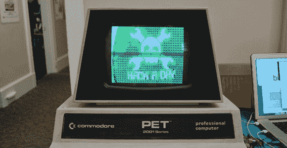

# VCF 东部:PetPix，流式图像到一个准将宠物

> 原文：<https://hackaday.com/2014/04/06/vcf-east-petpix-streaming-images-to-a-commodore-pet/>

以为老式电脑节只会是有数百人啄食的旧电脑打印“你好”转到 10？是的，有很多，但也有一些非常酷的新硬件应用。[迈克尔·希尔] [创造了 PetPix](http://www.bitfixer.com/bf/petpix) ，这是一款为 Commodore 宠物设计的视频播放器，当然还有 C64。

PetPix 获取任何视频文件(或摄像机中的视频流),并将每帧的 8×8 像素部分转换为 PETSCII。所有的处理都是在树莓派上完成的，然后发送给宠物，以获得令人惊讶的流畅视频。

当然，下面有一段 PetPix 的视频。还有几个来自[Michael]的视频介绍了 PetPix 的工作原理。

[https://www.youtube.com/embed/nUn6BbRDnpI?version=3&rel=1&showsearch=0&showinfo=1&iv_load_policy=1&fs=1&hl=en-US&autohide=2&wmode=transparent](https://www.youtube.com/embed/nUn6BbRDnpI?version=3&rel=1&showsearch=0&showinfo=1&iv_load_policy=1&fs=1&hl=en-US&autohide=2&wmode=transparent)

[https://www.youtube.com/embed/-JmQuTZR8Zs?version=3&rel=1&showsearch=0&showinfo=1&iv_load_policy=1&fs=1&hl=en-US&autohide=2&wmode=transparent](https://www.youtube.com/embed/-JmQuTZR8Zs?version=3&rel=1&showsearch=0&showinfo=1&iv_load_policy=1&fs=1&hl=en-US&autohide=2&wmode=transparent)

[https://www.youtube.com/embed/5JrXqFSXkWU?version=3&rel=1&showsearch=0&showinfo=1&iv_load_policy=1&fs=1&hl=en-US&autohide=2&wmode=transparent](https://www.youtube.com/embed/5JrXqFSXkWU?version=3&rel=1&showsearch=0&showinfo=1&iv_load_policy=1&fs=1&hl=en-US&autohide=2&wmode=transparent)