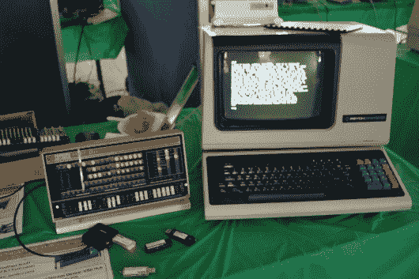
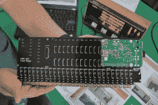
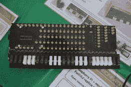

# VCF 东方 X:用树莓 Pi 进行迷你计算

> 原文：<https://hackaday.com/2015/04/19/vcf-east-x-minicomputing-with-the-raspberry-pi/>

新泽西州沃尔的老式电脑节不仅仅吸引当地人；[Oscar]从瑞士远道而来炫耀他的 PiDP-8/I。这是一台微型计算机，在 SimH 中模拟，闪光灯和拨动开关安装在树莓皮帽子上。

尽管 PiDP-8 模拟的是一台具有数千个分立晶体管的机器，但设计非常简单。板上有 92 个发光二极管，一堆二极管，26 个拨动开关，一个驱动芯片，仅此而已。开关和 led 的所有多路复用都由软件处理。在 Raspberry Pi 方面，[Oscar]能够运行 FOCAL、OS/8，并且像正常大小的 PDP-8 一样，可以手动切换程序。

[Oscar]不再连接 RK01 磁盘驱动器和 DECtapes 的带状电缆，而是模仿那些的带状电缆。所有存在于旧的数字存储介质上的文件现在都被塞进了 USB 拇指驱动器。USB 集线器插入 Pi，当这些 USB 磁盘包之一插入集线器时，加载操作系统或程序只需轻触几个拨动开关。

[Oscar]一直在努力将 PiDP-8 变成一个套件，展位周围的消息是，这将在今年夏天的某个时候发生。这个套件的预期价格非常有趣:在 100 美元到 150 美元之间。以这个价格，我们预计有人会很快安装一个基于 Arduino 的纸带阅读器，也许就在今天下午。

下面是 PiDP-8/I 的更多图片和视频。

      

[https://www.youtube.com/embed/5hyUActgT2E?version=3&rel=1&showsearch=0&showinfo=1&iv_load_policy=1&fs=1&hl=en-US&autohide=2&wmode=transparent](https://www.youtube.com/embed/5hyUActgT2E?version=3&rel=1&showsearch=0&showinfo=1&iv_load_policy=1&fs=1&hl=en-US&autohide=2&wmode=transparent)