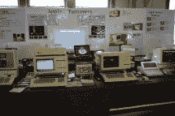

# VCF 东方 X:超级组合

> 原文：<https://hackaday.com/2015/04/23/vcf-east-x-the-mega-mix/>

东复古电脑节是上周末，现在是时候把一切都包起来了。我们将从一个视频开始，这个世界上最大的，最无法忍受的混蛋在阿什伯里公园的木板路上走来走去。感谢[弗兰]拍摄它。

[https://www.youtube.com/embed/SWmeQjMH7x4?version=3&rel=1&showsearch=0&showinfo=1&iv_load_policy=1&fs=1&hl=en-US&autohide=2&wmode=transparent](https://www.youtube.com/embed/SWmeQjMH7x4?version=3&rel=1&showsearch=0&showinfo=1&iv_load_policy=1&fs=1&hl=en-US&autohide=2&wmode=transparent)

尽管有糟糕的选角导演，但那段视频包括 PDP Straight-8 的展示，这是一台有 50 年历史的小型机，今年刚刚由[David Gesswein]进行了维修和翻新。你可以在下面看到更多的照片，在[【大卫】的网站](http://www.pdp8.net/index.shtml)上还有更多。

        

### 音乐

旧电脑意味着芯片音乐，婴儿猝死综合症的哔哔声，口袋妖怪，还有那些奇怪的雅马哈之类的东西，对吗？没有。[Anthony Stramaglia]展出了 Fairlight CMI，这是首批数字采样合成器之一。这实际上是[鲍勃·穆格]的费尔莱特。在深入研究技术细节和图片之前，这里有一个简短的即兴表演:

[https://www.youtube.com/embed/r929i6oacyU?version=3&rel=1&showsearch=0&showinfo=1&iv_load_policy=1&fs=1&hl=en-US&autohide=2&wmode=transparent](https://www.youtube.com/embed/r929i6oacyU?version=3&rel=1&showsearch=0&showinfo=1&iv_load_policy=1&fs=1&hl=en-US&autohide=2&wmode=transparent)

Fairlight CMI 基本上是基于 6800 的双 CPU 计算机。计算机包括两个用于存储样本的 8″软盘驱动器，以及一些用于缓冲和播放样本的语音卡。绿色的 CRT(带光笔)是 UI，是的，你可以在上面画样本。这是一项令人敬畏的技术，几乎可以在 80 年代的所有唱片中听到。

          

### 苹果的奇特之处

A working Lisa 1

苹果丽萨于 1983 年初发布，价格约为 10，000 美元。几乎所有这些设备都有缺陷，崔姬的软驱左右都有问题。1984 年，苹果发布了售价约 5000 美元的 Lisa 2，用可靠的索尼磁盘驱动器取代了 Twiggys。丽莎 1 号被悄悄地处理掉了。你可以正确地假设 Lisa 1 非常罕见，而一个能够工作的 Lisa 1 几乎闻所未闻。

[科里·利特尔]为他的展览带来了一些稀有的苹果。包括一个 IIc+，有可怕的液晶显示器，一个 III+，一个 Lisa 1 和 Lisa 2，还有一个非常有趣的 Apple I，它完全是线包的，就像[Woz]的原版一样。

      The underside of the wire-wrap job  IIc+ with the LCD      Autographed by Woz    A working Lisa 1

### 寄售商店

如果你去参加一个老式计算机节，你会带着比你进来时更多的东西离开，我不是在谈论对现代技术历史的更深的欣赏。不，人们在这里卖旧电脑，还有些好东西。

  The appreciation of mechanical keyboards  Eventually sold for $200  A guy came in with a box of core memory boards. He sold them for less than $10/board. The supply/demand/cost curve was all kinds of screwed up on this one.      Terminal keyboard for two dollars  They sold out of all the ET cartridges.  If someone knows what this weird style of 80s art is, tell me.  A bizarre digitizer for a trash 80\. Used for CAD, drafting, etc    Good lord  An AT&T UNIX system keyboard. Not shown – the UNIX system. Because the two guys that bought it bought just about everything.  Emates! They all needed power adapters, but they only cost about $30-$40\.

这只是 VCF 东方 X 的报道，至少在[布莱恩·克尼根]和[鲍勃·弗兰克斯顿]的视频上传之前是这样。在那之前，我会留给你这个:

