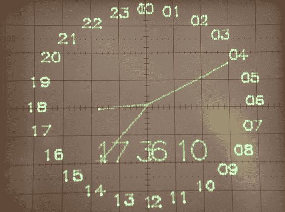

# 矢量显示介绍

> 原文：<https://hackaday.com/2012/12/05/vector-thingy/>

与老式大电视中的 CRT 不同，矢量显示器有点古怪。矢量显示器不是将电子束从左到右、从上到下扫过屏幕，而是在屏幕上的两点之间画线。矢量显示器曾经用于街机游戏，如*小行星*、*暴风雨*和旧的 FAA 显示器，但由于获得所需 CRT 的复杂性或难度，矢量显示器已经失宠。纽约电阻器[公司的人贴出了一个很棒的教程](http://www.nycresistor.com/2012/09/03/vector-display/)，用于启动和运行矢量显示器，甚至设法在示波器上安装了一个时钟。

让矢量显示器工作的关键部件是数模转换器。该 DAC 从 Teensy 2.0 dev 板上的 8 个引脚获取电压，并将其转换为 0 至 5 伏之间的任何电压。将该 DAC 的输出连接到示波器的输入后，微控制器可以在轴上的任意两点之间画一条线。

在休息后的视频中，您可以看到其中两个 DAC 连接到显示时钟的示波器。这是一件非常酷的作品，最终让你可能放在身边的古老的 CRT 示波器有了用途。