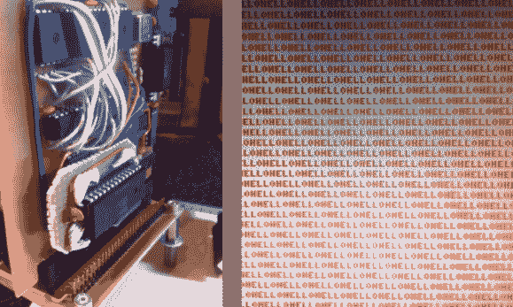

# 维罗妮卡 6502 电脑达到你好世界阶段

> 原文：<https://hackaday.com/2013/02/25/veronica-6502-computer-reaches-hello-world-stage/>

右边的截图显示了[Quinn Dunki's] [计算机项目显示一个 Hello World 程序](http://quinndunki.com/blondihacks/?p=1192)。嗯，现在只显示 Hello 这个词，但是概念是一样的。这证明了原生 6502 代码正在处理器上运行，并通过其 VGA 硬件可靠地输出数据。看到这个项目投入了这么多工作，这是一个可喜的成就。

但是对于如此复杂的东西，你不能指望在没有发现错误的情况下取得进展。旅程中的这一步对[奎因]来说意义重大。写完汇编代码并把它装入机器后，她沮丧地发现到处都是丢失的字符。现在她展示了一张截图，并说这很容易被识别为一种种族条件——证明她比我们有更大的大脑。

问题是在同一个 AVR 芯片上运行的一对不间断进程(她构建的 GPU 的[的一部分)。他们互相争夺处理器周期的控制权，她通过制作上图所示的子板解决了这个问题。它通过使用 IDT7200L FIFO SRAM 芯片，将一个时间关键型进程移出该 AVR 芯片来解决问题。](http://hackaday.com/2013/01/11/veronica-vga-board-finalized/)