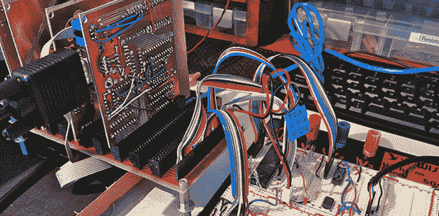

# Veronica 6502 通过 USB 获得键盘输入

> 原文：<https://hackaday.com/2013/07/06/veronica-6502-gets-keyboard-input-via-usb/>

当建造一台自制电脑时，有几个里程碑使所有的工作看起来都是值得的。当然，看到 CPU 一步一步地通过闪光灯上的地址行是最重要的，但更重要的是能够在键盘上键入字符并在显示器上显示出来。[Quinn]当她键入第一个字符时，不想让她的 Veronica 计算机处理串行终端或 PS/2 键盘；相反，她想用 80 年代的硬件阅读 USB 键盘。

早在 USB 的早期，设计规格和键盘制造商在几乎所有生产的 USB 键盘中都包含了传统模式。这允许 USB 键盘与古老的 PS/2 协议一起工作。[Quinn]利用 6522 多功能接口适配器，几乎每个 PS/2 键盘都具有这种功能。这个 VIA 与提供 GPIO 引脚和定时器的古老的 6502 CPU 属于同一个芯片家族。

[Quinn]将 PS/2 输入的键盘接头连接到 ATtiny13。这个微控制器从键盘上读取扫描码，并将它们发送到 VIA 和 Veronica 的其他部分。达到这一步需要做很多工作，但是[Quinn]终于有了一台可以打字的电脑，这是为她自制的电脑开发软件的第一步。