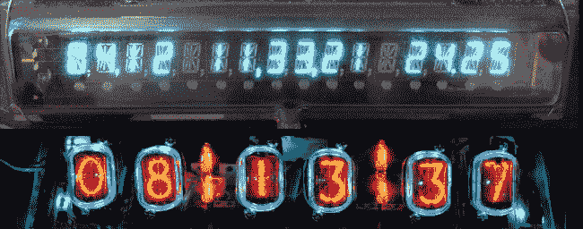

# VFD 和谢妮时钟二合一

> 原文：<https://hackaday.com/2013/12/10/vfd-and-nixie-clock-twofer/>

有时星星排成一行，我们会同时得到两个有点相似的版本。最近，值得注意的是使用某种显示管的时钟，所以我们开始了。

首先出场的是【Pyrofer】的 [VFD 网络时钟](http://www.pyrofersprojects.com/blog/vfd-clock-with-snmp-and-ntp/)(上图)。这个建筑是从他从一台旧的水果机中回收的真空荧光显示管开始的——不管那是什么。VFD 是 16 字符、14 段显示器，全部通过串行输入控制。

主控制板当然是一个 Arduino，带有 WizNet 5100 以太网板。时钟通过 DHCP 连接到互联网，因此不需要设置 IP 地址。一旦连接，时钟通过网络时间设置自己，并显示由 Dallas 单线温度探头提供的当前日期、时间和温度。

接下来是[Andrew]的漂亮的谢妮时钟,它有足够的 led 来满足最挑剔的技术爱好者的欲望。该板基于 PIC 微控制器，配有两个开关电源，一个用于 Nixies 的 170VDC，另一个用于板的其余部分。

电池供电的 DS1307 是该板的实时时钟，两个 MCP23017 I/O 扩展器用于运行老式的谢妮驱动程序

所有这些对于一个谢妮钟建筑来说都是相当标准的，虽然有点过分。然而，这对[安德鲁]来说还不够:他利用他的 PIC 上的 USB 支持在他的板上设置了一个 USB 端口，并为他的 PC 编写了一个很棒的软件来设置时间，上传新的固件，以及设置颜色渐变和速度。有这么多的发光二极管，你不希望在你的卧室里把所有的灯都开到最大，所以他实施了一个“睡眠”模式，关闭大多数灯和所有的谢妮管。这是一项伟大的工作，可以很容易地在 Kickstarter 上成功融资。