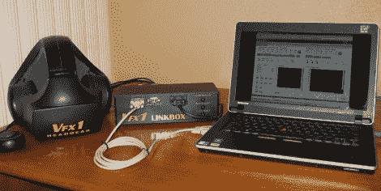

# VFX1 虚拟现实耳机链接盒

> 原文：<https://hackaday.com/2012/09/20/vfx1-virtual-reality-headset-linkbox/>

[ [凯文·梅洛特的](http://mellottsvrpage.com/ "Kevin Mellott's homepage ")对 [VFX1](http://www.youtube.com/watch?v=3yGiiU8_gnE "Vfx1 Virtual Reality Headset") 进行了更新，这样它就可以用于只需要一个 USB 插座和 VGA 接口的现代电脑。

VFX1 是一款虚拟现实耳机，于 90 年代上半期面市。该耳机是第一款面市的同类产品，领先于其所处的时代。VFX1 由 Forte Technologies 开发和销售，该公司的资产于 1997 年被 Vuzix 收购，vu zix 现在生产带有可选跟踪系统的现代视频眼镜。

(凯文)取得的成就是非凡的。最初的系统需要一个巨大的 ISA 卡和一个从这个卡到显示卡上的特征连接器的链接。[凯文]取消了 ISA 卡，FCON 用他所谓的 LinkBox 取而代之。此连接盒有串行或 USB 输出，接受立体声/单声道 VGA 输入或 RGB。

该系统现在可以用于现代计算机，包括笔记本电脑。那些进入虚拟现实的人真的应该看看这个。

1995 年 VFX1 的原始宣传视频

[https://www.youtube.com/embed/3yGiiU8_gnE?version=3&rel=1&showsearch=0&showinfo=1&iv_load_policy=1&fs=1&hl=en-US&autohide=2&wmode=transparent](https://www.youtube.com/embed/3yGiiU8_gnE?version=3&rel=1&showsearch=0&showinfo=1&iv_load_policy=1&fs=1&hl=en-US&autohide=2&wmode=transparent)

[Kevin]对他设计的带有 LinkBox 的 VFX1 进行了更新

[https://www.youtube.com/embed/WNxWm9gzFUk?version=3&rel=1&showsearch=0&showinfo=1&iv_load_policy=1&fs=1&hl=en-US&autohide=2&wmode=transparent](https://www.youtube.com/embed/WNxWm9gzFUk?version=3&rel=1&showsearch=0&showinfo=1&iv_load_policy=1&fs=1&hl=en-US&autohide=2&wmode=transparent) [https://www.youtube.com/embed/XRGVw2YiUME?version=3&rel=1&showsearch=0&showinfo=1&iv_load_policy=1&fs=1&hl=en-US&autohide=2&wmode=transparent](https://www.youtube.com/embed/XRGVw2YiUME?version=3&rel=1&showsearch=0&showinfo=1&iv_load_policy=1&fs=1&hl=en-US&autohide=2&wmode=transparent)