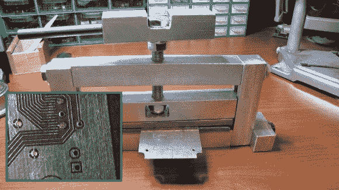

# 通过压力机挤压铜来实现机械连接

> 原文：<https://hackaday.com/2013/02/19/via-press-crushes-copper-to-make-a-mechanical-connection/>

大约五年前，当[Jay]偶然发现这篇文章时，他正在寻找一种在自制双面 PCB 上制作过孔的方法。此处显示的技术制造机械过孔，由[Retromaster]开发。不涉及焊接，而是他使用一些实心铜线和一个压力机将其紧紧压在电路板上。

压机由铝原料制成，带有几块与纸板接触的不锈钢板。铝原料很容易加工，但它相对较软，这就是添加钢的原因。他使用的铜线已经紧紧地嵌在基板的孔中。剪去尽可能靠近纸板的多余部分后，通过印刷机的一次行程会使每一侧变平，如插图所示。

我们查看了[Retromaster]的一些其他项目，如 FPGA 中的 Atari 2600 和这个仿真的[Amiga 软盘驱动器](http://hackaday.com/2010/07/28/emulating-an-amiga-floppy-drive/)。但是我们没有看到任何他使用这种粉碎技术的 diy 板。