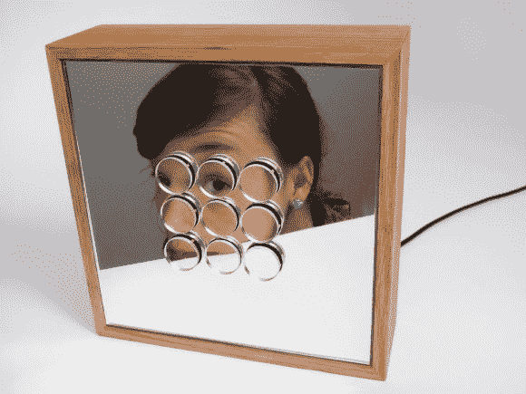

# 振动镜

> 原文：<https://hackaday.com/2013/12/28/vibe-mirror/>

我们喜欢 Hackaday 的一个与艺术相关的好项目，而[Wolfgang 的] [振动镜原型值得一看:](http://www.instructables.com/id/Vibrating-Pixels-Mechanical-Mirror/)当然是它扭曲的反光表面。

[Wolfgang]首先用激光从一面 8 英寸的方形镜子上切割出 9 个 1 英寸的圆，然后用强力胶将 1/4 英寸的氯丁橡胶片粘在方形镜子的背面，盖住孔。每个圆形切口都有一些定制的丙烯酸背衬，用一小段钢琴线粘在中间。最终的组合像一个巨大的图钉一样穿过氯丁橡胶衬里，从而将所有九个圆形镜子固定在适当的位置，而不限制移动。钢琴线的后端连接到另一片丙烯酸树脂上，后者粘在一个微型[振动马达](http://www.adafruit.com/products/1201)上。

他使用一些移位寄存器和一个 Arduino Uno 来控制电机，虽然没有源代码来浏览它，但我们猜测[Wolfgang]只是设计了九面镜子以不同的模式嗡嗡作响，并创建视觉上有趣的组成。休息之后，看看最终效果的快速视频，如果你能帮[沃尔夫冈]为他的设备起个名字，请在评论中提出你的建议。

[https://www.youtube.com/embed/0nV2EaPxYCI?version=3&rel=1&showsearch=0&showinfo=1&iv_load_policy=1&fs=1&hl=en-US&autohide=2&wmode=transparent](https://www.youtube.com/embed/0nV2EaPxYCI?version=3&rel=1&showsearch=0&showinfo=1&iv_load_policy=1&fs=1&hl=en-US&autohide=2&wmode=transparent)