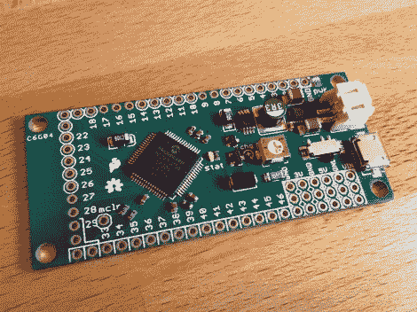

# 视频预览新的 i.o.i.o 原型

> 原文：<https://hackaday.com/2012/09/15/video-preview-new-ioio-prototype/>

我们拿到了新 IOIO 设计的原型。这是一个分线板，使向 Android 设备添加硬件变得非常容易。[Ytai Ben-Tsvi]将它发送给我们，并花了一些时间来解释该板与原始版本之间的一些差异。休息之后你可以看到我们嵌入的视频预览。

电路板的尺寸和外形保持不变，但器件的选择和布局发生了变化。最明显的是，USB-A 连接器不见了，取而代之的是 USB ~~mini-B~~ micro-B 连接器。这使得该板可以用作 USB 移动设备，或者借助于该板附带的适配器用作 USB 主机设备。JST 连接器用于外部电源。之前的版本包含了它的封装外形，但它从未被填充。电压调节电路也进行了升级，使用了更新的器件作为开关模式调节器。

在布局中发现了一个最后的错误。[Ytai]希望有一个安全的 5V 接地短路保护，并正在重新旋转电路板，以确保他实现这一目标。他不能肯定地说，但正如我们在[上一篇关于原型](http://hackaday.com/2012/05/29/new-ioio-in-the-works/)的帖子中提到的，降价是计划中的。它可能会将目前 50 美元的价格降至 30 美元，但这要等到第一次生产的所有选择都完成后才能决定。

[https://www.youtube.com/embed/d3ns0iqXwQA?version=3&rel=1&showsearch=0&showinfo=1&iv_load_policy=1&fs=1&hl=en-US&autohide=2&wmode=transparent](https://www.youtube.com/embed/d3ns0iqXwQA?version=3&rel=1&showsearch=0&showinfo=1&iv_load_policy=1&fs=1&hl=en-US&autohide=2&wmode=transparent)