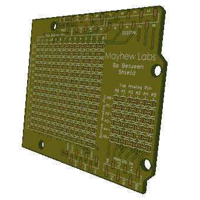

# 在浏览器中查看 Gerber 文件

> 原文：<https://hackaday.com/2012/04/17/view-gerber-files-in-3d-in-your-browser/>

[Mark]写道，渴望展示他创造的这个新工具，以 3d 方式查看你的 gerber 文件。他还写了一份说明书，帮助你[弄清楚如何使用这个工具](http://www.instructables.com/id/View-Your-PCB-Design-in-3D-Online-for-Free/)。作为一个浏览器内的工具，也意味着你可以把它拍摄给你的朋友，让他们快速地进行 3d 回顾。你们中的一些人可能不认为 3d 视图对这个过程有帮助，但我们认为这是一个受欢迎的功能，可能会在这里得到一些使用。

[Mark]指出它仍在积极开发中，因此如果您遇到任何问题，请通过网站上的表格向他报告。