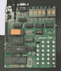

# 制造者集会上的老式电脑

> 原文：<https://hackaday.com/2015/05/17/vintage-computers-at-maker-faire/>

众所周知，Maker Faire 高度面向年轻群体。这并不意味着博览会完全没有历史意义；海湾地区的制造商集会正好位于计算机行业的中心，一些摊位正在展示计算机在过去四十年里到底走了多远。

[布瑞尔电脑公司的【文斯·布瑞尔】](http://www.brielcomputers.com/)有一个摊位展示他的商品，大多是老式电脑的现代翻版。他的桌子上摆满了 1s 的复制品[，这是一种小得多但仍然完全兼容 Apple I 的主板。](http://www.brielcomputers.com/wordpress/?p=1152) [MicroKIM](http://www.brielcomputers.com/wordpress/?cat=24) 亮相了，但皇冠上的明珠是【文斯】的 [Superboard III](http://www.brielcomputers.com/wordpress/?cat=39) ，它是[俄亥俄州科学超级板 II](http://oldcomputers.net/osi-600.html) 的复制品。这是一台基本的 6502 计算机，有 32k 内存，但与其他现代的复古计算机不同的是，[文斯]把键盘直接放在主板上。

开关是 Cherry MX，按键来自[wasd 键盘](http://www.wasdkeyboards.com/)。[Vince]实际上对制造现代 ASCII 键盘很感兴趣，以取代 70 年代和 80 年代家用电脑中老旧的主板。这可能是[文斯]将在未来某个时候发布的一个项目。

  MicroKIM  A much, much smaller version of the Altair  The Replica I, fully compatible Apple I replica  The Superboard III

#### [Jef Raskin]，Swift 卡和佳能猫

[史蒂夫·乔布斯]可能是麦金塔之父，但他绝不是 Mac 的唯一负责人。这是一个团队，当你谈论 Mac 的用户界面时，第一个出现的名字应该是[Jef Raskin]。

[杰夫·拉斯金]最好的作品之一是 Swyft 卡，它是 Apple II 的一个附件，基本上只是一个 ROM 卡，上面有一个 OS 和 Forth 解释器。Swyft 卡的显著特点是使用了“跳跃”键，这是使用电脑时改变上下文的一种简单方法。在之前，我们已经看过了 Swyft 卡的[复制品，由【Mike Willegal】在东部复古计算节上提供。](http://hackaday.com/2014/04/06/vcf-east-the-swyft-card/)

[vintage-computer.com](http://www.vintage-computer.com/)论坛的  【德怀特·埃尔维】带来了一些与【拉斯金】和佳能猫有关的额外特别物品。第一个是安装在 Apple IIe 中的 Swyft 卡。第二台是原型 Swyft 计算机，序列号 1 印在梁永能标签上，固定在机箱上。

[Dwight]称之为“woodie ”,它有两个 1.44 MB 的磁盘驱动器，其中一半的磁盘实际上是可用的。[Dwight]没有把机器拆开，但我 99%确定里面的 CRT 和早期 9 英寸 MAC 中的显像管是一样的。

在[Dwight]的展示中还有一台 Swyft 生产电脑和一台佳能猫，这是[Jef Raskin]对基于文本的电脑的最终构想。

老式电脑展台也有一些有趣的复古电脑，包括 Commodore 128D、苹果制造、贝尔和豪厄尔品牌的 Apple II 和 Amiga 2000。隔壁是计算机历史博物馆，他们带来了一个非常适合孩子的存储媒体展示。展示一张 10 年前的 8 英寸磁盘很有趣。

  Bell & Howell branded Apple II  Analog computer from the Computer History Museum. It was display Chua’s Circuit.  Cat Keyboard    Leap keys for the Canon Cat [![A Collection of [Jef Raskin]'s work](img/0d9d6ccea42fd2518942b284a5beece5.png "Jef Raskin")](https://hackaday.com/2015/05/17/vintage-computers-at-maker-faire/jef-raskin/) A Collection of [Jef Raskin]’s work