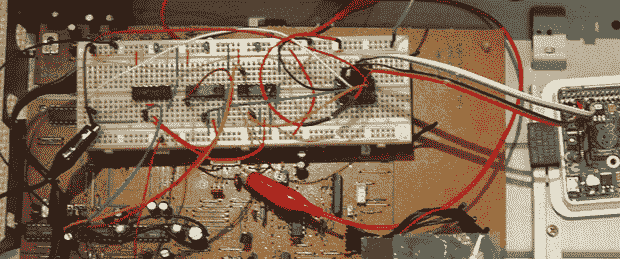

# 复古 DAC 和树莓派

> 原文：<https://hackaday.com/2014/02/23/vintage-dacs-and-a-raspberry-pi/>

在 iPod 接入每一件可以想象的音频设备之前，大多数设备实际上都做得非常好。大多数货架上的设备通常都配有使用优质元件的精心设计的电路，90 年代后期的 CD 播放器也不例外。[Mariosis]听说在这些设备中发现了一些非常好的 DAC，[决定带一个出去兜兜风](http://www.instructables.com/id/Vintage-DAC-for-RaspberryPi-audio/)。他用树莓皮来播放音频，用的是 90 年代末建伍 CD 播放器里的 DAC。

在《财富》杂志(fortune)看中了[Mariosis]工作台上的一款带死驱动器的 CD 播放器后，他翻出了维修手册，发现了一些有趣的芯片——一个 PCM56 DAC、一点逻辑和一个 SM5807 过采样芯片，该芯片为 DAC 完成所有转换。

这种过采样芯片使用 I2S(而非 I2C)总线将数据从 CD 传输到 DAC。当然，Raspi 有一个 I2S 驱动程序，但是第一次尝试播放音频没有任何结果。事实证明，过采样器的预期存在问题——“标准”I2S 信号比 LRCLK 信号延迟一个时钟周期。

有两种方法可以解决这个问题:编写内核驱动程序，或者构建一些自定义逻辑来解决这个问题。显然，打破一些触发器和或非门是更酷的选择，给[Mariosis]一个伟大的声音与老式 DAC 立体声。