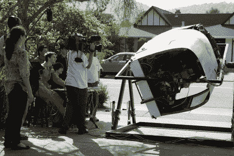

# 毒蛇飞行模拟器(洛杉矶太空堡垒卡拉狄加)完成

> 原文：<https://hackaday.com/2012/05/22/viper-flight-simulator-a-la-battlestar-galactica-finished/>

这里有一个关于一些人着手为《太空堡垒卡拉狄加》中的蝰蛇制作飞行模拟器的故事。我们的目标是为创客大会带来一个宏大的项目。对于过去几年一直参与的小组来说，这是一个经常性的挑战。但今年，他们决定做大，并在 Kickstarter 上成功发起了一项活动，以帮助降低成本。

获得构建细节的最好地方是[他们的进度更新页面](https://sites.google.com/site/mf2012theviper//progress)。每周，青少年骨干们都会试着发布一些关于他们进步的信息，当我们看完这些信息后，我们的脸上都会露出灿烂的笑容。模拟器的目的是给你提供尽可能多的太空飞行体验，因为重力会对你造成限制。驾驶舱可以在每个方向滚动和俯仰 360 度。当然，安全是一个问题，他们对他们的框架设计和飞行员约束系统非常小心。但是这不仅仅是身体构造的问题。有声音、灯光和虚拟模拟器，所有这些都以令人印象深刻的质量水平完成。发布了大量视频，我们在休息后嵌入了一个展示驾驶舱仪表板的短片。

[https://www.youtube.com/embed/nWMSCJisjnA?version=3&rel=1&showsearch=0&showinfo=1&iv_load_policy=1&fs=1&hl=en-US&autohide=2&wmode=transparent](https://www.youtube.com/embed/nWMSCJisjnA?version=3&rel=1&showsearch=0&showinfo=1&iv_load_policy=1&fs=1&hl=en-US&autohide=2&wmode=transparent)

via [ [Gizmodo](http://gizmodo.com/5894951/these-kids-are-building-a-battlestar-galactica-viper) ]