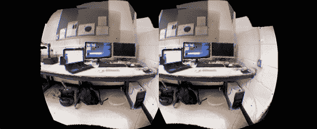

# 具有 Kintinuous 和 Oculus Rift 的虚拟物理现实

> 原文：<https://hackaday.com/2014/06/21/virtual-physical-reality-with-kintinuous-and-an-oculus-rift/>

Kinect 长期以来一直能够创建真实物理空间的逼真 3D 模型。[将这些 Kinect 映射的空间与 Oculus Rift](https://developer.oculusvr.com/forums/viewtopic.php?f=29&t=9697) 结合起来是一件全新的事情。

[Thomas]和他在 Kintinuous 项目中的同胞们正在用旧的 XBox 360 Kinect 的 RGB+D 传感器模拟一个办公空间。然后使用 Oculus Rift 在那个空间居住。他们也没有使用 Oculus 中的内部 IMU 来定位虚拟空间中的摄像头:他们使用 Kinect 的实时深度感应来馈送 Rift 屏幕。

虽然 Kintinuous 在绘制大规模空间地图方面非常非常好，但是软件本身如果被锁定在作者和开发者无法控制的版权问题之后。然而，这并不意味着 kintinous 背后的技术被锁死了:任何人都可以自由阅读论文([这里有一篇](http://dspace.mit.edu/bitstream/handle/1721.1/71756/MIT-CSAIL-TR-2012-020.pdf?sequence=1)、[和另一篇](http://18.7.29.232/bitstream/handle/1721.1/73167/MIT-CSAIL-TR-2012-031.pdf?sequence=1)，当然是 PDF)并将 kintinous 重新实现为一个开源项目。这将是非常酷的事情，我们鼓励任何有点点云经验的人尝试一下。

下面视频。

[https://www.youtube.com/embed/mnvQiJ5xQt4?version=3&rel=1&showsearch=0&showinfo=1&iv_load_policy=1&fs=1&hl=en-US&autohide=2&wmode=transparent](https://www.youtube.com/embed/mnvQiJ5xQt4?version=3&rel=1&showsearch=0&showinfo=1&iv_load_policy=1&fs=1&hl=en-US&autohide=2&wmode=transparent)