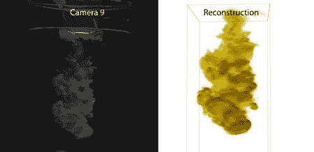

# 可视化水滴和建造 CT 扫描仪

> 原文：<https://hackaday.com/2012/08/26/visualizing-water-droplets-and-building-a-ct-scanner/>

由于在今年的 SIGGRAPH 上向一大群荒谬的人展示他的项目，他的神经受到了损伤，[James]终于准备好与更多的观众分享他通过光学断层摄影混合液体的方法:Hackaday 的读者。

[James]'项目关注的是从多摄像机设置中模拟混合液体的问题。硬件相当简单，只有 16 台消费级摄像机围绕一个装满水的玻璃烧杯排成半圆形。

当[詹姆斯]向水中注入一点染料时，扩散的云被几台索尼摄像机捕捉到。来自这些摄像机的图像通过一种算法发送，该算法选择云中的一个点，并执行随机行走以找到液体染料云中的每隔一个点。

所有这些计算的结果是一个字面上的体积云，允许[詹姆斯]以他选择的任何方式渲染，切片和切割染料云。休息过后，你可以看到这个非常酷的版本制作的视频。

[https://player.vimeo.com/video/40171658](https://player.vimeo.com/video/40171658)[https://www.youtube.com/embed/QV7qgAwGp4E?version=3&rel=1&showsearch=0&showinfo=1&iv_load_policy=1&fs=1&hl=en-US&autohide=2&wmode=transparent](https://www.youtube.com/embed/QV7qgAwGp4E?version=3&rel=1&showsearch=0&showinfo=1&iv_load_policy=1&fs=1&hl=en-US&autohide=2&wmode=transparent) [https://www.youtube.com/embed/mV6vh_xM0hI?version=3&rel=1&showsearch=0&showinfo=1&iv_load_policy=1&fs=1&hl=en-US&autohide=2&wmode=transparent](https://www.youtube.com/embed/mV6vh_xM0hI?version=3&rel=1&showsearch=0&showinfo=1&iv_load_policy=1&fs=1&hl=en-US&autohide=2&wmode=transparent)