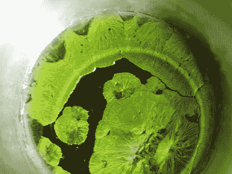

# 用于检测香兰素存在的维生素 C

> 原文：<https://hackaday.com/2012/08/28/vitamin-c-used-to-detect-the-presence-of-vanillin/>

[Markus Bindhammer]最近在他的家庭实验室进行传导化学实验时有了一个发现。[抗坏血酸可用于检测香兰素的存在](http://markus-bindhammer.blogspot.com/2011/11/reaction-of-vanillin-with-ascorbic-acid.html)。反应从颜色变化开始，从清澈的液体变成深绿色。当他继续加热混合物时，他得到了上面看到的表面结晶。

香草醛是一种有机化合物，你通常会在香草精中发现，人造品种被用于仿制香草精。抗坏血酸是一种维生素 c。当[Markus]第一次观察到颜色变化时，他认为这可能是由于金属污染，但在没有使用金属工具或探针的情况下再次进行实验，产生了相同的结果。

你可以在休息后的片段中看到，没多久就变绿了。在加入抗坏血酸之前，香兰素必须加热到 130 摄氏度，否则不会发生颜色变化。他认为这是一种检测物质中香兰素存在的可靠方法。

[https://www.youtube.com/embed/6A01A4ID24o?version=3&rel=1&showsearch=0&showinfo=1&iv_load_policy=1&fs=1&hl=en-US&autohide=2&wmode=transparent](https://www.youtube.com/embed/6A01A4ID24o?version=3&rel=1&showsearch=0&showinfo=1&iv_load_policy=1&fs=1&hl=en-US&autohide=2&wmode=transparent)