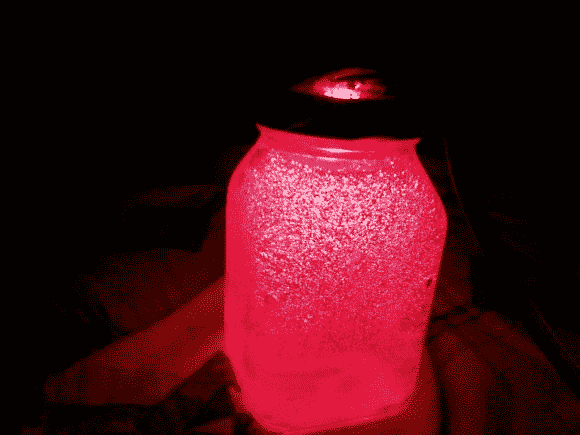

# 声控 RGB LED 灯

> 原文：<https://hackaday.com/2014/08/17/voice-controlled-rgb-led-lamp/>

[Saurabh]想要一个快速的项目来展示构建语音控制的设备是多么容易。他最新的 [Instructable](http://www.instructables.com/id/Quanto-Dynamic-Lamp-1/?ALLSTEPS "instructables") 使用 Arduino 和 Visual Basic .Net 实现了这一点。

决定建造一个声控灯。他知道他想让它改变颜色并且节能。它还必须易于控制。显而易见的选择是使用 RGB LED。LED 本身不会很有趣。他需要某种东西来漫射光线，比如灯罩。[索拉博]决定从一个空玻璃罐开始。他在罐子里装满了凝胶蜡，这提供了一个很好的表面来漫射光线。

RGB LED 安装在瓶子的螺旋盖下面。[Saurabh]将一个 220 欧姆的限流电阻焊接到 LED 的三个阳极上。帽子上钻了一个洞，这样他就有地方放电线了。然后 LED 被连接到 Arduino Leonardo 上。

Arduino sketch 有几个内置的函数来设置所有的颜色，也可以淡入淡出。【Saurabh】然后用 Visual Basic .Net 写了一个控制界面，界面可以让你直接操纵灯，但也内置了语音识别功能。这使得[索拉博]可以用他的声音来改变灯的颜色，关掉它，或者启动一个渐暗的路径。您可以观看以下语音控制的视频演示。

[https://www.youtube.com/embed/3rGhNaXeTB0?version=3&rel=1&showsearch=0&showinfo=1&iv_load_policy=1&fs=1&hl=en-US&autohide=2&wmode=transparent](https://www.youtube.com/embed/3rGhNaXeTB0?version=3&rel=1&showsearch=0&showinfo=1&iv_load_policy=1&fs=1&hl=en-US&autohide=2&wmode=transparent)