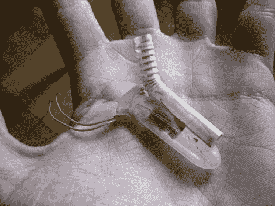

# 水下机器人推进的“涡流驱动”

> 原文：<https://hackaday.com/2012/08/10/vortex-drive-for-underwater-rov-propulsion/>

这是【李·冯·克劳斯’】为水下机器人设计的新型[实验推进系统。他在考虑如何将](http://www.instructables.com/id/Vortex-Drive-Micro-ROV-ROVVor)[刚毛机器人](http://hackaday.com/2011/03/13/bristlebot-mod-never-rubs-you-the-wrong-way/)用于水下时发展了这个概念，刚毛机器人利用振动在固体表面上摆动。

和它的陆地亲戚一样，这项技术使用了一个微型的传呼机马达。该设备被设计为当电机旋转时振动，这要归功于连接到主轴的偏心重量。[李的]第一个实验是把马达推进离心管，让它在水下旋转。他可以看到从发动机发出的波向外传播，但这东西哪儿也不去。他需要的是一些牙刷毛。他开始思考这些刚毛实际上是如何工作的。它们允许设备向一个方向移动比向另一个方向移动更容易。与此相对应的水上平台是一个倾斜的平台，在一个方向上有更大的阻力。他抓起一根柔韧的吸管，用柔韧的部分提供所需的表面。

休息后请观看演示视频。他没有把它和血管联系起来，但是肯定有运动。

[https://www.youtube.com/embed/45U8vDhMX3s?version=3&rel=1&showsearch=0&showinfo=1&iv_load_policy=1&fs=1&hl=en-US&autohide=2&wmode=transparent](https://www.youtube.com/embed/45U8vDhMX3s?version=3&rel=1&showsearch=0&showinfo=1&iv_load_policy=1&fs=1&hl=en-US&autohide=2&wmode=transparent)