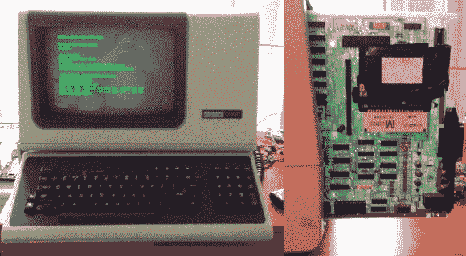

# VT100 变得鹰钩鼻状

> 原文：<https://hackaday.com/2013/10/16/vt100-gets-beagleboned/>

如何让一个优秀的终端变得更好？答案很简单:[给它加个比格犬骨黑！](http://www.brendanp.com/vt100-beaglebone-mod/)【布伦丹】得到了经典计算的主要产品之一， [DEC VT100 终端。](http://en.wikipedia.org/wiki/VT100)vt 100 生产于 1978 年至 1983 年。该终端被广泛使用，成为其他终端效仿的标准。今天打开任何终端程序，您都有可能找到 VT100 仿真的设置。

[Brendan]最初将他的终端连接到运行 Linux 的笔记本电脑上。终端、电缆和笔记本电脑本身变得很难在一张小桌子上管理。为了解决这个问题，他决定在终端外壳内添加一种猎兔犬黑色。事实证明，VT100 实际上通过其[标准终端端口(STP)连接器](http://www.willsworks.net/pdp11/vt1xx.htm#STP)实现了这一点。STP 被设计为在终端的串行流中添加一个“桨板”。DEC 和第三方制造商使用此端口向 VT100 添加从磁盘驱动器到整个 CPM 计算机的所有内容。

[Brendan]开始设计 VT100 和 BeagleBone 之间的接口板。板级将串行线从 BeagleBone 转移到 VT100。STP 还允许终端向 BeagleBone Black 供电。他确实注意到 VT100 的电源出现了一些故障。标准 TI TL77xx 电压监控器芯片解决了这一问题。整个设计中最难的部分是 STP 的卡边缘连接器。第一次尝试就确定了尺寸。最终，[Brendan]得到了一个非常干净的安装，不需要对经典的硬件做任何修改。

我们应该注意到，大多数 PCB 公司使用化学镀镍浸金(ENIG)作为标准涂层。这将适用于插入和拔出几次的卡边缘连接器。经常插入和取出的卡(如经典的控制台墨盒)会很快刮掉 ENIG 涂层。镍上电镀金是卡边缘连接器的经典材料，但是这种工艺很可能不会便宜到业余爱好者的数量。