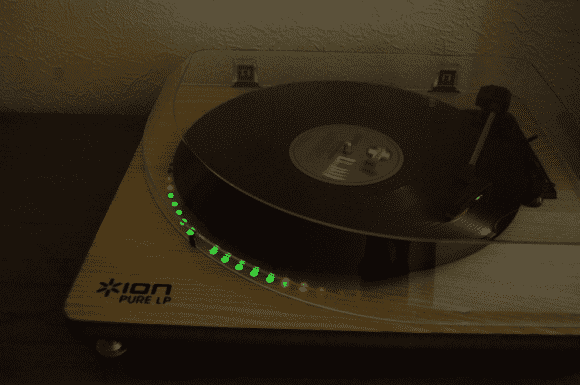

# VU 电唱机点亮了它

> 原文：<https://hackaday.com/2014/07/07/vu-meter-record-player-lights-it-up/>

[Michal Duerinckx]去年生日时，未婚妻送了他一个转盘——从那以后，他开始收集唱片，比如《无名小卒的生意》。但是大约一个月前，他开始渴望做一个电子项目——他决定升级他的唱机，加入一个 VU 电度表！

当他开始设计时，他很快意识到他没有做好这个项目所需的所有工具——这是去他当地的 makerspace 查看的完美借口。

他开始在试验板上制作 VU 电度表的原型，并打开了电唱机——就好像这个东西是用来被黑客攻击的。两个免费的电源连接为他的电路供电，答对了！

在搞清楚所有的连接并在唱机上测试后，他终于有了一个可行的设计。是时候为它制作自己的 PCB 了。他已经将原理图上传到 GitHub，以防有人有兴趣自己做类似的事情。使用 SoMakeIt 的设备，并在另一位制造商[Dave]的帮助下，[Michal]能够按照他的设计蚀刻 PCB，填充它，并成功测试。现在他只需要在他的唱机上钻几个洞，然后安装发光二极管。

[https://www.youtube.com/embed/2ZWDgeX37AE?version=3&rel=1&showsearch=0&showinfo=1&iv_load_policy=1&fs=1&hl=en-US&autohide=2&wmode=transparent](https://www.youtube.com/embed/2ZWDgeX37AE?version=3&rel=1&showsearch=0&showinfo=1&iv_load_policy=1&fs=1&hl=en-US&autohide=2&wmode=transparent)

说到 VU 米，你见过这么大的吗？