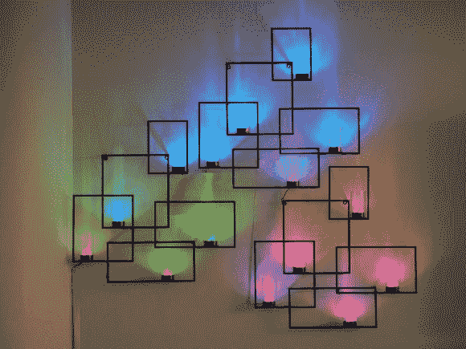

# 用发光立方体控制的墙壁显示装置

> 原文：<https://hackaday.com/2013/02/06/wall-votive-display-controlled-with-a-glowing-cube/>

这种壁挂看起来很棒，即使它只是点亮。但是多亏了一个独特的控制器，它可以作为你生活区域的互动显示器。

长方形和许愿蜡烛杯是一套三个商店购买的悬挂物。但是点燃蜡烛并记得吹灭它们是一件痛苦的事情，所以[阿黛尔·费尔南德斯]决定增加 led 来简化这项工作。但为什么要止步于此，除了每个杯子都有一个 RGB 灯，他还让它们完全可寻址。灯光秀更好，但这也为各种不同的用途开辟了舞台。

伴随墙面装置的是一个手掌大小的立方体，可以放在咖啡桌上。立方体的任何一边都可以设置显示功能，旋转可以调整功能，快速旋转用作选择。如果电源图标朝上，快速旋转将打开或关闭显示屏。还有天气、温度、交通(我们想的是类似[公交车时刻表通知](http://hackaday.com/2012/03/19/never-miss-your-transport-with-this-bus-arrival-notifier/)的功能，但实际上有点不同)和动画模式。休息之后，您可以观看立方体功能的演示。

[https://www.youtube.com/embed/RyGQ1oQidBs?version=3&rel=1&showsearch=0&showinfo=1&iv_load_policy=1&fs=1&hl=en-US&autohide=2&wmode=transparent](https://www.youtube.com/embed/RyGQ1oQidBs?version=3&rel=1&showsearch=0&showinfo=1&iv_load_policy=1&fs=1&hl=en-US&autohide=2&wmode=transparent)

[谢谢伊莱亚斯]