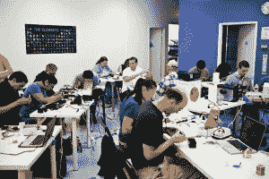
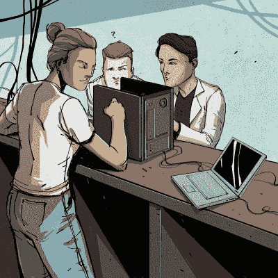

# 想在你的车库里创建私人实验室吗？从加入你的黑客空间开始

> 原文：<https://hackaday.com/2015/08/31/want-to-create-a-fablab-in-your-garage-start-by-joining-your-hackerspace/>

对于许多硬件爱好者来说，很难停止想象在我们的车库里有一个全能的私人实验室的可能性——一套辉煌的机器，可以制造我们梦想中的部件。这些年来，我们中的许多人开始建造这样的东西，组装令人惊叹的工作台，让我们其他人垂涎三尺。问题是:“我们如何到达那里？”

好吧，假设我们有一个空白的车库。我们也许可以拿起几个工具，然后“随波逐流”，边走边自学基础知识，从错误中学习。有了足够的耐力，十年后我们醒来会意识到，在数控铣床、车床、o-scope、逻辑分析仪和书架上的项目墓地中——我们成功了！

[![Image Credit: [Rupunzell] on EEVBlog](img/b9120d255bc2d57cfbba04f066716c3c.png)](https://hackaday.com/wp-content/uploads/2015/08/eevblogrupunzel.jpg)

Image Credit: [Rupunzell] on EEVBlog

然而，“随遇而安”可以从我们的钱包里榨出最后一点零钱——更不用说 10 年是一段独自飞行的漫长旅程。硬件要花钱。没有目标的实验，没有理解“什么期望是现实的”的空间，当事情发生时会花费很多钱。

如今，互联网可能会很好地把有相同兴趣的人聚集在一起。但是，在交换与贸易工具直接相关的技术知识方面，情况如何呢？我们能从聊天室中获得与本地“CNC 耳语者”几分钟交谈同样的体验吗？他们能告诉我们关于调整机器 PID 控制器的详细情况。

我会说我们就是不能。任何主题的“开始”通常看起来令人生畏，但我们处于一个复合的劣势，因为论坛上的大师们有一些关于该主题的共享隐性知识和行话，如果我们真正迈出第一步，我们就不会有。(不要害怕，虽然；我们没有一个人天生就有这种东西！)

排除了采取我们的第一个婴儿步骤的论坛，我们可以在哪里找到“经验丰富的古鲁”给我们的基础知识？不太可能有哪家咖啡店会有当地的硬件专家一边喝咖啡一边回答问题。不过，不要害怕；有地方让黑客们得到他们的寄托。

## 进入黑客空间

进入黑客空间。随着咖啡杯和桌布被烙铁和 3D 打印机取代，这些地方[分散在世界各地](https://wiki.hackerspaces.org/List_of_Hacker_Spaces)，到处都是被同样的机器吸引的修补匠和 DIY 爱好者。黑客空间为本地黑客提供了一个栖身之所，带来了一些工具，并推出了一些项目。有些，像湾区的 [HackerDojo](http://www.hackerdojo.com/About) ，有一套通用的工具。其他的，像 [BioCurious](http://biocurious.org/) ，迎合了更多的小众兴趣。有了会员费和可能的一些轻型设备培训，你就可以加入了！

### 隐藏的用户手册

Tinkerers at BioCurious. Image credit: BioCurious

黑客空间给了我们一些互联网和我们空荡荡的车库所没有的东西:工具的前台和“下班后”工程师的后台，他们可以告诉我们如何使用它们。如果你从未用旋转立铣刀切下一块铝，Hackerspace 可能是做这件事的好地方。首先，我们没有自己购买机器的前期成本。第二，给定一些机器时间，我们现在有机会学习如何正确使用它。我不是说前面提到的用“别人的设备”进行的“盲目实验”相反，我是说，在这里，在那台数控台式轧机前，是一个很好的时间来问“我如何将这种铝原料切割成我想要的形状？”

### 工作流程

黑客空间也展示了一个工作流程。对于我们某天想要放在车库里的任何工具来说，建立一个“工具链”以使该工具有用是一个不平凡的过程，我们必然会有一系列的问题。以数控铣床为例。从最初的想法到最终的设计需要几个步骤。首先，有用于设计零件的计算机建模软件。“黑客空间用的是什么？搅拌机？AutoCAD？”接下来是 CAM 软件，它将我们的 3D 模型转换成一系列指令，也称为代码，用于切割我们的零件。"黑客空间用的是 Mach3 还是 CamBAM？"最后，CNC 铣床(或另一台机器)根据 GCode 中定义的刀具路径切割出我们的零件。“黑客空间是如何将他们的手工工具转换成 CNC 的？他们用的是 GRBL、LinuxCNC，还是别的？”黑客空间是一个观察成功工作流程的好地方。这是一个地方，我们可以问问题的过程，以便有一天我们可以定义自己的。

### 文化

 既然我们在这里，就有必要后退一步，环顾四周。在一端，我们可能会看到一个家伙把两根绞在一起的电线放进手钻里，快速地把它们拧成双绞线。另一方面，我们可能会看到几个学生在他们的 Segway-bot 上保持平衡，当它第一次平衡时欢呼雀跃！这是我们的文化，从中我们也可以学到做生意的诀窍，有时通过问问题，有时只是四处看看。如果我们被埋在车库里，我们可能不会学到我们这个时代的一些成熟的技巧——或者更糟——我们会重新发明另一个轮子，并认为自己很聪明！唉，当我们发现自己把一对电线插进手钻里盘绕起来的时候，我们很容易觉得自己很聪明，但这种事以前也发生过。相反，我们可以访问黑客空间，发现我们文化的其余部分已经开发的锦囊妙计的边缘。一旦我们遇到了这个边缘，我们就可以开始把它推得更远一点。

## 真实的故事

大约一年前，我去了趟湾区的 HackerDojo，借了点时间在带锯上。在这次旅行中，我打包了我最新项目的盒装残片和我的相机来记录进度。当我打开行李时，我意识到在角落里，一位留着浓密雪白胡须的老年绅士一直在专注地盯着我的相机。他走近我说，

"你那辆 60D 真不错。"

他凑过来低声说道:

“我有 40D。”

他从他的双光眼镜上方久久地看了我一眼，告诉我，

“如果你愿意，我可以教你如何正确使用它。下周再来吧。”

第二周我回来了，在大约两个小时的时间里，我们在我的相机上完成了基本的*光圈*、*光圈*、*快门速度*和 *ISO* 设置。我本可以花一周时间自学这些话题，在网上搜索，试图回答这个问题“关于用相机拍照，我应该知道些什么？”相反，在两个小时内，我记下了基础知识，不仅仅是基础知识，还有词汇和继续我的拍照冒险的心理模型。黑客空间的真正宝藏就在这里。聚集在带锯、电阻箱和烙铁周围的是一群日常补锅匠，与你我并非完全不同。

所以前进吧；参观这些地方！是的，你会找到你一直在寻找的工具。但你也会发现其他东西:专业知识的文化和分享它的渴望，这是一个更难找到的东西。