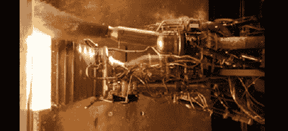

# 今天下午现场观看火箭发动机测试

> 原文：<https://hackaday.com/2012/04/30/watch-a-rocket-engine-test-live-this-afternoon/>

如果你想在今天下午看到一些令人敬畏的东西，请在美国东部时间下午 3:00/太平洋时间下午 12:00/格林威治时间下午 7:00 观看 SpaceX 的引擎测试直播。你将看到九个[梅林火箭发动机](http://en.wikipedia.org/wiki/Merlin_(rocket_engine))在即将向国际空间站发射龙太空舱的测试中加满推力。

这只是一个静态测试—*希望*九个梅林引擎不会跑偏。为了了解这些引擎背后的动力[这是大约一年前在得克萨斯州 SpaceX 开放大厅发射的梅林引擎的测试](http://www.youtube.com/watch?v=YnGDU9Wz4f0)。今天，*9 台*发动机将同时点火。

休息后看看视频，看看猎鹰 9 号会有多棒。

通过[砰砰](http://boingboing.net/2012/04/27/spacex-falcon-9-engine-test-wi.html)

[https://www.youtube.com/embed/UMqyS6FWeA8?version=3&rel=1&showsearch=0&showinfo=1&iv_load_policy=1&fs=1&hl=en-US&autohide=2&wmode=transparent](https://www.youtube.com/embed/UMqyS6FWeA8?version=3&rel=1&showsearch=0&showinfo=1&iv_load_policy=1&fs=1&hl=en-US&autohide=2&wmode=transparent)
[https://www.youtube.com/embed/VfOo7QAoZys?version=3&rel=1&showsearch=0&showinfo=1&iv_load_policy=1&fs=1&hl=en-US&autohide=2&wmode=transparent](https://www.youtube.com/embed/VfOo7QAoZys?version=3&rel=1&showsearch=0&showinfo=1&iv_load_policy=1&fs=1&hl=en-US&autohide=2&wmode=transparent)