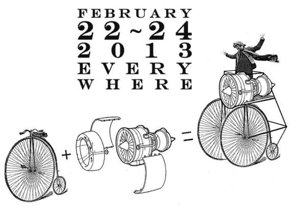

# 看着 50 个团队做出很酷的东西

> 原文：<https://hackaday.com/2013/02/23/watching-50-teams-build-something-cool/>

去年夏天，我们在 Hackaday 参加了红牛创作比赛。基本上，12 个团队被给予网络摄像头和指令来建造一些很酷的东西。这些团队直播了他们的构建过程，其中的佼佼者赢得了去纽约创客节的机会。[杰森·瑙莫夫]，幕后黑手[现在又在做这件事](http://thedeconstruction.org/)。它被称为解构主义，它汇集了 6 大洲的 50 个团队，在将他们的项目上传到互联网的同时，创造出一些很酷的东西。

解构主义与红牛的竞赛有一点不同——首先，团队没有机会获得数量多得可笑的能量饮料。其次，团体参赛作品没有固定的主题。这是一个自由开放的平台，团队可以做他们喜欢的任何东西。

我们真的不得不称赞[杰森]完成了这件事。他主持了红牛创作大赛的现场直播——几乎全程 72 小时——直到最后一刻都很有趣。你可以在主解构网站查看官方流[，也可以在这里](http://thedeconstruction.org/)查看[个人团队流。](http://thedeconstruction.org/teams/)