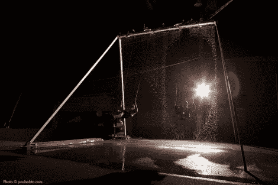

# 瀑布秋千

> 原文：<https://hackaday.com/2012/10/14/waterfall-swing-set/>

[掺杂硼]写信告诉我们关于[Dash 7]的瀑布摆动。自然，我们不知道什么是“瀑布秋千”。该设备在 2011 年的世界创客博览会上展示，它是一个秋千，一次可以容纳一两个人使用。有趣的是，水从顶部支撑杆流出，形成一道水墙，供骑手通过。当秋千使用者飞过时，这堵墙就被打破了，这是一种干燥的体验。

根据该文章，273 个电磁阀用于控制水墙。这些螺线管由一台带有传感器的计算机控制，这些传感器可以检测驾驶者在空中的位置和速度。与大多数好的黑客一样，它可能不适合“成人”的目的，但一套肯定会使公园之旅更有趣！

请务必在休息后观看视频。第一个展示了秋千的传统作用，但第二个可能更有趣，展示了对水书写的秋千螺线管的完全控制！

[https://www.youtube.com/embed/p1uwQVtHHOQ?version=3&rel=1&showsearch=0&showinfo=1&iv_load_policy=1&fs=1&hl=en-US&autohide=2&wmode=transparent](https://www.youtube.com/embed/p1uwQVtHHOQ?version=3&rel=1&showsearch=0&showinfo=1&iv_load_policy=1&fs=1&hl=en-US&autohide=2&wmode=transparent) [https://www.youtube.com/embed/-_XqAP0k1yw?version=3&rel=1&showsearch=0&showinfo=1&iv_load_policy=1&fs=1&hl=en-US&autohide=2&wmode=transparent](https://www.youtube.com/embed/-_XqAP0k1yw?version=3&rel=1&showsearch=0&showinfo=1&iv_load_policy=1&fs=1&hl=en-US&autohide=2&wmode=transparent)