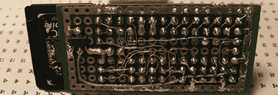

# WAV 音乐播放器使用 ATtiny

> 原文：<https://hackaday.com/2012/11/11/wav-music-player-uses-an-attiny/>

我们非常习惯于看到小型媒体播放器，但[txyz]的 [ATtiny 驱动的音频播放器](http://txyzinfo.blogspot.com/2012/11/AVR-attiny2313-wav-music-player-from-SD-card-microSD-MMC.html)是我们见过的最小、功能最丰富的播放器之一。

音频播放器由非常小且非常便宜的 ATtiny2313 驱动。音乐存储在 SD 卡上——最多 2GB 的 WAV 文件，以 32kBps 的速度录制在 8 位深度的单声道中。启动时，ATtiny 从卡中加载第一个音频文件，并通过扬声器连接输出。

为了让事情变得有趣，[txyz]通过串行连接控制音频播放器。一旦一个小型 FTDI 适配器连接到播放器上，[txyz]就可以通过终端连接到它，并运行他的播放列表。

尽管可以通过串口控制播放器，但是如果需要的话，还有一些引脚可以让[txyz]连接到按钮上。有了电池组，这将把他的音乐播放器变成相当于 iPod shuffle 的自制音乐播放器。由于组件数量少，如果[txyz]的时间是空闲的，它实际上可能比 shuffle 更便宜。

休息后的视频。

[https://www.youtube.com/embed/ydJdBmdGjUY?version=3&rel=1&showsearch=0&showinfo=1&iv_load_policy=1&fs=1&hl=en-US&autohide=2&wmode=transparent](https://www.youtube.com/embed/ydJdBmdGjUY?version=3&rel=1&showsearch=0&showinfo=1&iv_load_policy=1&fs=1&hl=en-US&autohide=2&wmode=transparent)