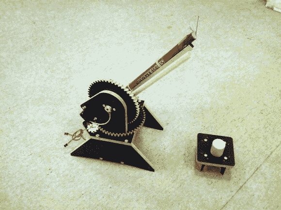

# 挥舞着那支罗马蜡烛，不要拿手指冒险

> 原文：<https://hackaday.com/2012/12/31/wave-that-roman-candle-around-without-risking-your-digits/>

有些人不介意少了一两根手指，但我们非常珍惜我们所有的手指。这也是为什么我们从来没有在点燃导火索后紧抓着烟花不放。[Dzl]和他的儿子想要(至少在某种程度上)安全，同时仍然有那种乐趣。所以他们建造了这个装置，让你在安全的距离内绕着罗马蜡烛挥舞。它也不严格限于一种类型的烟花。你可以看到有一个聚氯乙烯桶，它会向任何方向发射一个瓶子火箭。正如你所猜测的，视频中展示了跳跃后的一次试运行。

这个装置是由激光切割尼龙部件制成的。如果你缺少自动复制的设备，不要担心。手工制作这些类型的零件并不困难。让它运转的马达只是业余爱好的伺服系统，用来持续旋转。[Dzl]增加了外部电位计用于位置反馈。

这是一种平淡的庆祝新年的方式，如果昨天的项目对你来说有点太难的话，这很好。

[https://embedr.flickr.com/photos/8324494403](https://embedr.flickr.com/photos/8324494403)