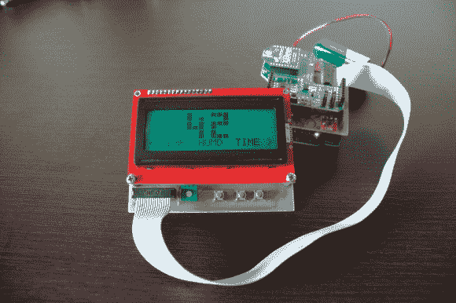

# 网页上的气象站图表历史

> 原文：<https://hackaday.com/2013/01/10/weather-station-graphs-history-on-webpage/>

荣誉归于[Jose]的工作，他让这个 Arduino 气象站中如此多的不同组件相互交流，以至于使用树莓 Pi 来在线显示数据。

上面显示的组件构成了传感器组件。有一个 Arduino 带有定制的屏蔽，可以连接气压传感器、实时时钟芯片、数字温度传感器和湿度传感器。在屏蔽层之上是一个 XBee 屏蔽层，它可以将数据推回基站。[Jose]还集成了一个 LCD 字符显示器和几个按钮，这样用户就可以查看天气数据，而无需进入网络。

Raspberry Pi 板构成 XBee 对的另一半。它使用 USB 至串行转换器电缆从无线电模块获取输入数据。你可以在上面链接的网页上看到数据日志。只需选择“实时”菜单选项并点击“每日”即可更好地了解湿度和压力的变化。