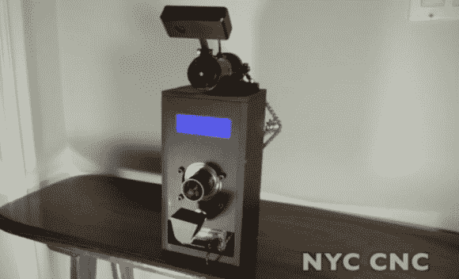

# 网状连接的零食分配器安抚宠物

> 原文：<https://hackaday.com/2013/02/05/web-connected-treat-dispenser-appeases-the-pets/>

[John]正在为他新买的树莓派寻找一个项目，并决定让他的狗也参与进来。虽然他完成的项目看起来很像一个老式相机，但它实际上是一个联网的零食分配器，使用他的狗的电子邮件地址进行分配。

让我们从上到下看一下硬件。有一架相机用鹰眼拍下了它的毛茸茸的朋友等待款待的画面。下面的圆柱体是驱动零食分配器的马达。您可以看到背面的链条张紧器，它将电机连接到盒子中央的管状分配器。在那个出口的正上方是字符显示器，它向观看分配器的任何人提供反馈。靠近底部是一个漏斗，它接住零食，然后翻转过来把它们倒在地板上。最后，底部是一个用于驱动一切的树莓 Pi 的插槽。

[约翰]的大部分项目都围绕数控工作。除了休息后发现的演示视频，还有第二个重点是 CAD 设计。在该片段的大约一半处，他向我们展示了所有硬件的特写镜头。

[https://www.youtube.com/embed/PAHrBA0jYAo?version=3&rel=1&showsearch=0&showinfo=1&iv_load_policy=1&fs=1&hl=en-US&autohide=2&wmode=transparent](https://www.youtube.com/embed/PAHrBA0jYAo?version=3&rel=1&showsearch=0&showinfo=1&iv_load_policy=1&fs=1&hl=en-US&autohide=2&wmode=transparent)

[https://www.youtube.com/embed/pl--QiB9FOY?version=3&rel=1&showsearch=0&showinfo=1&iv_load_policy=1&fs=1&hl=en-US&autohide=2&wmode=transparent](https://www.youtube.com/embed/pl--QiB9FOY?version=3&rel=1&showsearch=0&showinfo=1&iv_load_policy=1&fs=1&hl=en-US&autohide=2&wmode=transparent)

[谢谢约瑟夫]