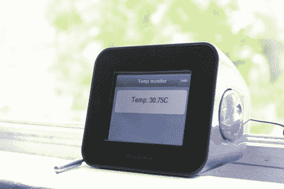

# Chumby 上的 WebKit 让开发者避开 Flash

> 原文：<https://hackaday.com/2012/05/29/webkit-on-chumby-lets-developers-avoid-flash/>

[Huan Truong]正在为他的一个项目寻找一个互联网接口。在这种情况下，它是一个温度记录器，但它可以是任何东西。他决定尝试一下 Chumby，但被它使用 Flash 作为应用程序框架所拒绝。他决定通过定制的 Chumby 固件运行 WebKit 来提供更多的选择。

在休息后的视频中，他展示了启动序列，并演示了他的第一个应用程序。设备通电时会进行屏幕校准。当这个应用出现时，它的外观和响应更像一个 Android 或 iPhone 应用，而不是我们习惯的 Chumby 界面。这种技术为你提供了非常广泛的应用程序开发语言。这是因为 Chumby 真正关心的是作为接口的 index.cgi 文件。开发和调试可以在桌面上完成(以前并不是不能，但是 Linux 下的 Flash 开发总是很痛苦)。

看起来这个想法并不新鲜，但是我们不记得有任何其他项目使用 WebKit 作为替代的 Chumby 接口。

[https://www.youtube.com/embed/BKt6DeOQZt0?version=3&rel=1&showsearch=0&showinfo=1&iv_load_policy=1&fs=1&hl=en-US&autohide=2&wmode=transparent](https://www.youtube.com/embed/BKt6DeOQZt0?version=3&rel=1&showsearch=0&showinfo=1&iv_load_policy=1&fs=1&hl=en-US&autohide=2&wmode=transparent)