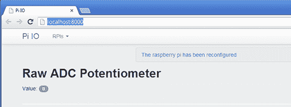

# WebSockets、Raspis 和 GPIO

> 原文：<https://hackaday.com/2013/02/07/websockets-raspis-and-gpio/>

不久前，[Blaise]曾尝试让 WebSocket 协议与 PIC 微控制器、WiFi 适配器和一些电位计、旋钮和开关一起工作。这在当时是一个优秀的项目，但现在[Blaise]有了树莓 Pi，以及相关的 GPIO 引脚和以太网连接。他决定是时候升级他的版本到 Pi 了，这次是他称之为 PiIO 的项目。

[Blaise]项目的基本思想是需要一个 Pi、一台服务器和一台为最终用户运行浏览器的计算机。在构建的 Pi 端，[Blaise]通过 SPI 总线连接了一个[微芯片 MCP3008](http://www.microchip.com/wwwproducts/Devices.aspx?dDocName=en010530) 八输入 10 位 ADC。Pi 从电位计、按钮或任何其他模拟源获取 ADC 传感器值，并通过 WebSocket 协议将其发送到服务器。

服务器托管一个用 Django、 [Autobahn](http://autobahn.ws/) 和 Python 编写的网站，与 Pi 通信，并托管从 Pi 接收的数据的网页。在[Blaise]的构建中有对多个 pi 的支持，使得我们甚至无法想象的复杂项目变得非常可能。

[Blaise]放一个 PiIO up 的牛逼演示视频；休息之后你可以去看看。

[https://www.youtube.com/embed/wZw16UzSvsM?version=3&rel=1&showsearch=0&showinfo=1&iv_load_policy=1&fs=1&hl=en-US&autohide=2&wmode=transparent](https://www.youtube.com/embed/wZw16UzSvsM?version=3&rel=1&showsearch=0&showinfo=1&iv_load_policy=1&fs=1&hl=en-US&autohide=2&wmode=transparent)