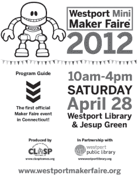

# 韦斯特波特迷你创客节是康涅狄格州的第一个

> 原文：<https://hackaday.com/2012/04/27/westport-mini-maker-faire-is-the-first-for-connecticut/>

如果您在康涅狄格州韦斯特波特，或者在一日游的距离内，您可能想看看本周末在那里举行的[迷你创客集会。在韦斯特波特图书馆&杰瑟普·格林](http://www.westportmakerfaire.org/)举行，除了通常的制造商和黑客聚会之外，还将有几个有趣的计划活动。当地的黑客空间也将出席。

一些计划中的活动包括自制乐队的战斗、rube goldberg 活动和自制乐队的即兴表演。也看看嘉宾发言人，有几个名字是我们希望看到的。