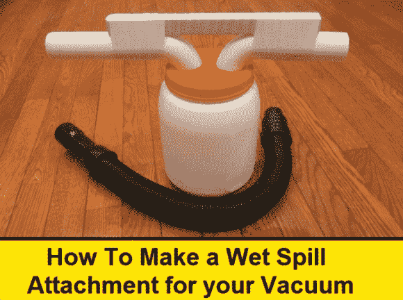

# 湿式溢出真空吸尘器附件

> 原文：<https://hackaday.com/2013/06/13/wet-spill-vacuum-cleaner-attachment/>

你不得不佩服[娄]，他不仅知道如何建立简单的项目，他还知道如何出售他们的价值。这里有一个湿式溢出真空吸尘器附件,你可以很便宜地组装它。最终产品的照片没有他的视频那样有影响力，视频展示了它在清理一只从地毯上吐出来的模拟猫中的用途。

从图片中，我们相信你已经知道它是如何工作的。空气和潮湿的物质从一边进入，当空气从另一边被吸出时，空气和潮湿的物质落入罐子里。[Lou]建议从你的回收箱里找罐子。入口和出口都是聚氯乙烯 P 型存水弯的一部分，用于水槽排水。它们有一个螺纹法兰，防止零件从盖子上钻的 1.5”孔中穿过。

这将是最好的工作与高流量车间真空。既然你已经拿出了工具，为什么不[也做一个灰尘分离器](http://hackaday.com/2009/10/13/diy-dyson-vac-hack/)呢？

[https://www.youtube.com/embed/GrgSlbnjy-U?version=3&rel=1&showsearch=0&showinfo=1&iv_load_policy=1&fs=1&hl=en-US&autohide=2&wmode=transparent](https://www.youtube.com/embed/GrgSlbnjy-U?version=3&rel=1&showsearch=0&showinfo=1&iv_load_policy=1&fs=1&hl=en-US&autohide=2&wmode=transparent)