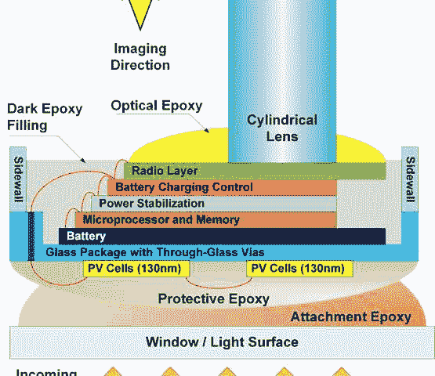

# 这是什么？蚂蚁的电脑！？

> 原文：<https://hackaday.com/2015/04/16/what-is-this-a-computer-for-ants/>

如果孩子们连电脑都看不见，我们怎么能指望教他们使用电脑呢？我不想听你的借口！电脑至少要…比这个大三倍！

由密歇根大学开发的密歇根微尘(M3)很可能是世界上最小的计算机。大概一粒米大小。

多层 PCB(断裂后显示)具有 7 层元件，用环氧树脂包围以提供保护。待机时仅消耗 2 纳安培，计算机可以由 1 平方毫米的太阳能电池供电。它被设计成粘在窗户上使用。它能够通过传感器输入数据，能够处理和存储数据，然后无线输出数据。目前它的范围只有 2 米，但他们希望将其扩展到 20 米左右。

欲了解更多信息，请查看以下视频:

[https://www.youtube.com/embed/xYct31tFHnc?version=3&rel=1&showsearch=0&showinfo=1&iv_load_policy=1&fs=1&hl=en-US&autohide=2&wmode=transparent](https://www.youtube.com/embed/xYct31tFHnc?version=3&rel=1&showsearch=0&showinfo=1&iv_load_policy=1&fs=1&hl=en-US&autohide=2&wmode=transparent)

物联网看起来很有前景。另一方面，秘密间谍更可怕。

本，谢谢你的提示！]