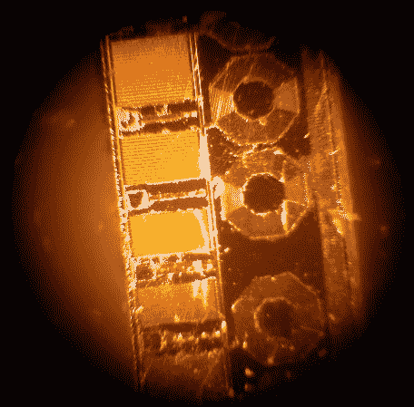

# USB 隔离器里面有什么？

> 原文：<https://hackaday.com/2014/04/21/whats-inside-a-usb-isolator/>

在这次酸动力拆卸中，[Lindsay] [打开了一个 USB 隔离器](http://imajeenyus.com/electronics/20131025_ic_decapping/index.shtml)的盖子，看看隔离是如何工作的。去封装器件是 ADI 公司的[adum 4160](http://www.analog.com/en/interface-isolation/digital-isolators/adum4160/products/product.html)。ADI 公司解释称，该器件采用 iCoupler 技术，由片内变压器组成。

【Lindsay】按照【Ben Krasnow】的[视频教程](https://www.youtube.com/watch?v=mT1FStxAVz4&feature=youtu.be)讲述了芯片如何去盖，但是把硝酸换成了浓硫酸，这样更容易获得一点。这个过程包括加热芯片，同时使用酸。随着时间的推移，包装材料被溶解，只留下硅。果然，三个芯片中的一个由五个线圈组成，构成了隔离变压器。每个变压器有 15 个绕组，走线只有 4μm 厚。

休息过后，你可以看一段芯片被热酸吃掉的延时录像。如需进一步了解，ADI 公司有一篇关于 iCoupler 工作原理的论文【PDF 警告】。

【感谢克里斯的提示！]

[https://www.youtube.com/embed/fPsNrbhGRMw?version=3&rel=1&showsearch=0&showinfo=1&iv_load_policy=1&fs=1&hl=en-US&autohide=2&wmode=transparent](https://www.youtube.com/embed/fPsNrbhGRMw?version=3&rel=1&showsearch=0&showinfo=1&iv_load_policy=1&fs=1&hl=en-US&autohide=2&wmode=transparent)