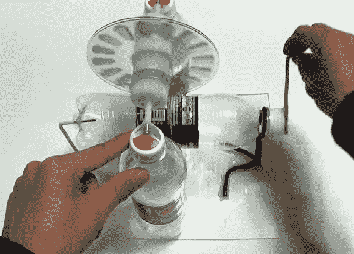

# 异想天开的自制 Wimshurst 机器

> 原文：<https://hackaday.com/2014/07/12/whimsical-homemade-wimshurst-machine/>

你的回收箱里有空塑料瓶，或者你的桌子上堆满了空塑料瓶？然后你就有了像托马斯·金(Thomas Kim)那样建造自己的 Wimshurst 机器所需的大部分材料。这个[演示和构建视频](http://www.youtube.com/watch?v=v_K9bMGcaug)是他的 YouTube 频道的众多宝藏之一。他展示了运转中的机器，然后花了几分钟的时间展示了他如何使用塑料瓶、激光打印机的导电刷、废弃的光盘和一束铜线来制作它的心脏。作为奖励，他用自制的泰瑟枪去除了 CD 上的导电材料和颜料。作为一个超级特别的奖励，这个视频没有 EDM 配乐，只有生产力的声音。

Wimshurst 机器是一种静电发电机，比特斯拉线圈稍微早一点。它的工作原理是将电荷从一个旋转的圆盘传递到另一个反向旋转的圆盘上。当电荷到达收集梳时，就储存在莱顿瓶中。最后，它在一个漂亮的火花中放电，循环重新开始。一旦你过度震惊你的朋友，用你的 Wimshurst 机器做一个[静电除尘器](http://hackaday.com/2014/03/13/cleaning-up-smoke-with-an-electrostatic-precipitator/)。

[https://www.youtube.com/embed/v_K9bMGcaug?version=3&rel=1&showsearch=0&showinfo=1&iv_load_policy=1&fs=1&hl=en-US&autohide=2&wmode=transparent](https://www.youtube.com/embed/v_K9bMGcaug?version=3&rel=1&showsearch=0&showinfo=1&iv_load_policy=1&fs=1&hl=en-US&autohide=2&wmode=transparent)

[感谢 Niklas 发送此邮件]