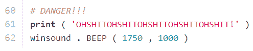

# WiFinder 是一个 Python 驱动的室友警告系统

> 原文：<https://hackaday.com/2014/06/28/wifinder-is-a-python-driven-roommate-warning-system/>

我们都经历过。你的室友终于出门了，你有了独处的时间。等一下…你的室友从没说过他们什么时候回来。如果能提前得到警告就好了。你该怎么办？[Mattia]绞尽脑汁寻找这个问题的解决方案，但他意识到这个问题非常简单。他的室友一直在警告他。他就是不听。

大多数黑客读者家里可能都有 WiFi 网络。如今，大多数人的移动电话都被配置为在覆盖范围内自动连接到这些网络。这通常是明智的，因为它可以通过不使用您昂贵的 4G 数据计划来为您省钱。[Mattia]意识到他可以通过无线网络来查看室友的手机何时突然出现。如果他们的设备出现在网络上，很可能他们刚刚到达，正在前往前门的路上。

输入 [wifinder](https://github.com/mpescimoro/WiFinder/blob/master/wifinder.py "Wifinder") 。Wifinder 是 Mattia 编写的一个简单的 Python 脚本，用于不断扫描网络并提醒他有新设备。一旦他的室友都走了，Mattia 就可以开始写剧本了。然后，它将运行 NMap 来获取网络上所有设备的列表。此后，它会定期运行 NMap，将新主机列表与旧列表进行比较。如果有任何新设备出现，它会发出一声哔哔声和一个非常滑稽的输出字符串。这种类型的扫描对网络安全领域的人来说并不陌生，但使用案例却相当新颖。