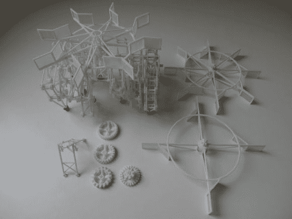

# 风力驱动的 Strandbeest 可以在陆地上无限漫游

> 原文：<https://hackaday.com/2014/06/11/wind-powered-strandbeest-could-roam-the-land-indefinitely/>

我们不得不承认，Strandbeests 是近年来我们最喜欢的机械发明之一——多足的、栩栩如生的四处行走的机械装置？太棒了。[Eric]想设计一些真正酷的东西——所以他决定为[Theo Jansen 的]strand beest——AG5&AG7 型号——建造一个涡轮机附件。

如果你不熟悉的话， [Strandbeest](http://hackaday.com/2010/03/24/theo-jansen-like-the-professor-from-gilligan/) 是一个可以走动的机械装置。它由西奥·詹森研发多年，并由 T4 的其他人在 T2 建造了多年。早在 2007 年，西奥甚至就此做过一次 TED 演讲。

Strandbeest 的想法是让它自己自主移动——不允许使用电子设备！[Theo]已经为他的一艘 3D 打印的 Strandbeests 设计了一个螺旋桨附件,但[Eric]想更进一步。他设计了一个功能更强的风力涡轮机，位于 Strandbeest 的顶部，允许来自任何方向的风使它行走。

[https://www.youtube.com/embed/cmO1UIEUu-E?version=3&rel=1&showsearch=0&showinfo=1&iv_load_policy=1&fs=1&hl=en-US&autohide=2&wmode=transparent](https://www.youtube.com/embed/cmO1UIEUu-E?version=3&rel=1&showsearch=0&showinfo=1&iv_load_policy=1&fs=1&hl=en-US&autohide=2&wmode=transparent)

我们真正喜欢[Eric 的] Instructable 的是，他经历了整个设计过程，展示了他是如何学习他需要知道的东西的(他没有任何类型的工程背景)，以及他是如何将它分解成更小的块以便于管理。这正说明了如果你下定决心做某事，你就能做到！