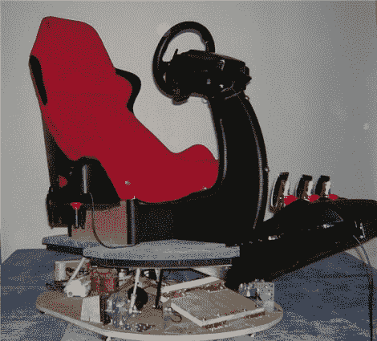

# 刮水器电机运动模拟器

> 原文：<https://hackaday.com/2012/09/24/wiper-motor-motion-simulator/>

【德里】着手打造[两自由度运动模拟器](http://www.x-simulator.de/forum/2dof-wiper-motor-car-simulator-by-deriy-sato-t2405.html "2 DOF Wiper Motor Simulator")用于驾驶模拟。四个月后，他花了大约 400 美元完成了这个令人印象深刻的模拟器。模拟器从游戏中接收驾驶数据，并驱动座椅向驾驶员提供触觉反馈。

为了保持低成本，他决定使用刮水器电机来驱动座椅。该系统由[灭霸 AMC 运动控制器](http://www.x-sim.de/forum/viewtopic.php?f=39&t=132 "AMC Controller")控制。这个基于 AVR 的系统通过 USB 连接并控制电机驱动器。还有一系列用于校准系统的软件，包括调整 PID 控制和设置反馈电位计。LCD 显示屏提供操作过程中系统状态的一些信息。

如果你曾经想建立一个运动模拟器，这是一个如何开始的好例子。为此，开源硬件使控制系统变得更加容易，使用现成的组件可以降低构建成本。

休息之后，请观看模拟器的运行视频。

[https://www.youtube.com/embed/VFtJk9StXCI?version=3&rel=1&showsearch=0&showinfo=1&iv_load_policy=1&fs=1&hl=en-US&autohide=2&wmode=transparent](https://www.youtube.com/embed/VFtJk9StXCI?version=3&rel=1&showsearch=0&showinfo=1&iv_load_policy=1&fs=1&hl=en-US&autohide=2&wmode=transparent)