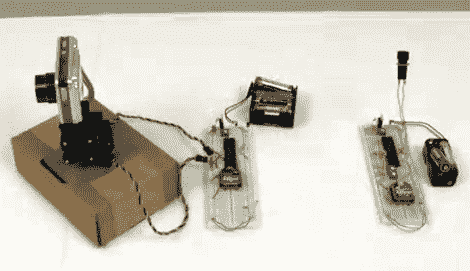

# 无线摄像头支架提供平移和倾斜功能

> 原文：<https://hackaday.com/2012/03/31/wireless-camera-mount-offers-pan-and-tilt-functions/>

[Chris]将一堆通用组件组装在一起[为安全摄像头或机器人创建这个无线云台系统](http://www.pyroelectro.com/tutorials/xbee_pan_tilt_servo/index.html)。

电动底座非常简单，使用两个伺服系统来组成数码相机的底座。在这种情况下，他使用了一个零件包，旨在安装相互垂直的伺服系统。你也可以 3D 打印，我们可以很容易地制作你自己的支架。控制电路由一对 PIC 18LF4520 微控制器和一组 Xbee 模块组成。这就是无线连接的用武之地。

在发射器端，微控制器的 ADC 读取一对电位计，并将其转换为位置值。接收器接收这些值，并相应地驱动伺服电机。在广告之后的剪辑中,[Chris]使用了微型微调工具，需要螺丝刀进行调整。你可能想去零件箱看看你是否能找到一些更方便用户使用的轴或旋钮。

不幸的是，这个系统不传输视频。但是 WiFi 网络摄像头越来越便宜，所以在这种情况下这可能是一个好的选择。[https://www.youtube.com/embed/OdylCNybuUU?version=3&rel=1&showsearch=0&showinfo=1&iv_load_policy=1&fs=1&hl=en-US&autohide=2&wmode=transparent](https://www.youtube.com/embed/OdylCNybuUU?version=3&rel=1&showsearch=0&showinfo=1&iv_load_policy=1&fs=1&hl=en-US&autohide=2&wmode=transparent)