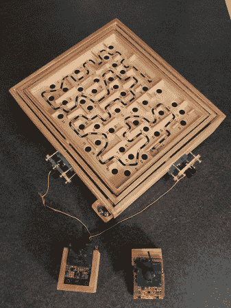

# 无线大理石迷宫使用 TI 开发硬件

> 原文：<https://hackaday.com/2013/08/11/wireless-marble-labyrinth-uses-ti-dev-hardware/>

如今有这么多价格实惠的开发硬件，你甚至不用接触烙铁就可以做很多事情。这是一个最好的例子。德州仪器软件工程师[Jordan Wills]最近完成了这个无线控制的大理石迷宫。

像这样的大理石迷宫是电子修补的热门目标。我们已经看到[智能手机被用作控制器](http://hackaday.com/2013/02/22/smartphone-controlled-labyrinth/)，还有其他的[分发巧克力糖](http://hackaday.com/2010/01/13/cubicle-dwellers-rewarded-for-reflexes/)。这一次[乔丹]坚持用商店买的游戏来简化构建。一位同事帮忙把两个控制旋钮换成了伺服电机。这些接口与 Stellaris Launchpad 连接，后者具有 SensorHub booster pack (shield)和 CC2533 无线电收发器模块。同样的硬件也构成了远程单元。这将通过读取升压包中的陀螺仪、加速度计和磁力计，将遥控器变成空中鼠标。

他没有在他的项目日志中特别提到它，但我们认为磁力计用于同步基本单元和用户遥控器之间的方向。即使基本单元的电路板与你拿遥控器的方式成 90 度安装，你仍然可以调整代码中的读数，对吗？

[https://www.youtube.com/embed/NUIewWkACPk?version=3&rel=1&showsearch=0&showinfo=1&iv_load_policy=1&fs=1&hl=en-US&autohide=2&wmode=transparent](https://www.youtube.com/embed/NUIewWkACPk?version=3&rel=1&showsearch=0&showinfo=1&iv_load_policy=1&fs=1&hl=en-US&autohide=2&wmode=transparent)