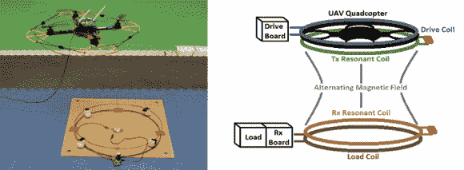

# 四旋翼飞行器的无线能量传输

> 原文：<https://hackaday.com/2014/01/01/wireless-power-transfer-for-quadrotors/>

四旋翼飞行器很棒，但是你真的能让它们飞多远？如果你只需飞过高压电线，经过充电站或在充电站附近暂时盘旋，就能给它们充电，那会怎么样？这正是 Carrick Detweiler 博士]写的一篇论文！(注意:PDF)

本文讨论了通过磁共振进行无线电力传输的方法，根据规模，该方法可以在中等距离(~1 米)传输电力。这优于电感耦合，电感耦合需要更近的距离(约 1-2 厘米)来传输功率。它仍然需要一定的准确性，但我们都知道，四旋翼飞行器即使是最复杂的空气动力学壮举也没有问题！

休息后，有一个小规模无线四旋翼飞行器原型的精彩演示视频。

[https://www.youtube.com/embed/iE9hwguNQyg?version=3&rel=1&showsearch=0&showinfo=1&iv_load_policy=1&fs=1&hl=en-US&autohide=2&wmode=transparent](https://www.youtube.com/embed/iE9hwguNQyg?version=3&rel=1&showsearch=0&showinfo=1&iv_load_policy=1&fs=1&hl=en-US&autohide=2&wmode=transparent)

对无线电力传输感到好奇？几年前，我们还报道了一篇关于倏逝波耦合背后的[理论的文章！](http://hackaday.com/2011/01/14/theory-behind-evanescent-wave-coupling-aka-wireless-power/)

[Via [Hizook](http://www.hizook.com/blog/2012/04/17/wireless-power-transfer-ground-sensors-using-uav-quadrotor)