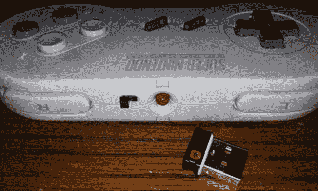

# 罗技接收机的无线 SNES 控制器

> 原文：<https://hackaday.com/2013/11/19/wireless-snes-controller-for-logitech-receiver/>

不久前，罗技公司为键盘、鼠标和其他人性化外设推出了他们的无线接口版本。是的，他们本可以使用蓝牙，但这无关紧要。然而，我们所知道的是，现在有可能将这些罗技发射器中的一个塞进超级任天堂控制器中，允许它与你花哨的无线键盘和鼠标一起操作。

[Warrior_Rocker]希望尽可能多地保留原始控制器的原厂外观。为此，他从一个旧的手持罗技键盘/触摸板组合中回收了罗技发射器。键盘的薄膜直接连接到发射器，这意味着需要追踪薄膜到每个引脚的连接，以获得有意义的按钮映射。

一旦 SNES 控制器的线路连接到发射器上，[勇士]就需要一种方法来为他的新无线控制器供电。旧键盘使用一对并联的 AA 电池。有了两个 AA 电池，键盘有大约一年的电池寿命，所以有了一个 AAA 电池，[勇士]的 SNES 控制器应该可以持续几个月或更长时间。

除了一个开关和一根缺失的电缆，[勇士]的无线控制器看起来就像一个股票控制器。相当令人印象深刻，考虑到这个构建是他刚刚放在周围的东西的产物。