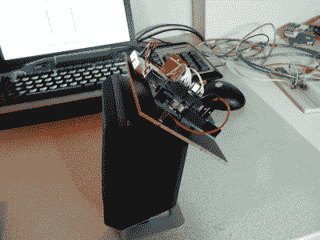

# 使用 Arduinos 和 2.4 GHz 收发器制作的无线扬声器

> 原文：<https://hackaday.com/2012/11/23/wireless-speaker-made-using-arduinos-and-2-4-ghz-tranceivers/>

[Texane]拿起一个 2.4 GHz 的发射器/接收器对，用于无线传输传感器数据。在一个项目中使用它们后，他想尝试推动它们一点，看看在更高的带宽方面有什么限制。他最终建造了一个无线扬声器，以大约 90 KB/s 的速度传输音频。该链接指向他的 git 存储库的一个子文件夹。这个项目的代码在 RX 和 TX 文件夹中，图像和视频在 DOC 文件夹中。

他使用的无线电硬件是 Nordic nRF24L01P 芯片，可从 Sparkfun 的分线板上获得。[Texane]向我们提到，芯片包括错误检查、数据包确认和自动重传。但是这些增加了开销，会降低速度。该芯片确实提供了禁用这些功能的选项，以获得对硬件的低级访问。这正是他所做的，他提到他为发射器和接收器编写的示例代码使每个周期都有价值。这让我们想知道是 ATmega328 芯片的速度还是收发器本身是瓶颈？