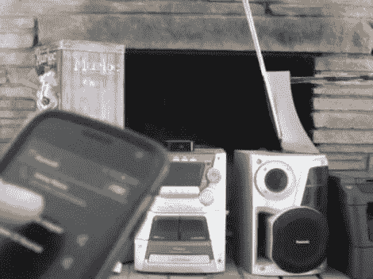

# 无线立体声插件打开一些音乐的接收器和管道

> 原文：<https://hackaday.com/2012/09/05/wireless-stereo-add-on-turns-on-receiver-and-pipes-in-some-music/>

[PC486]想要在简单的架子立体声系统中添加蓝牙功能。但是，如果你要去无线，为什么不开发一个一体化的解决方案。他的适配器打开立体声系统，并通过智能手机向其输入音频。

这是他室友的硬件，所以撬开它拿熨斗并不是一个真正的选择。他需要一种方法来控制系统，而不需要任何永久性的改动。由于该单位有红外遥控能力，这是最明显的方式去。但是原来的遥控器已经不在了，所以他不得不上网。幸运的是，遥控代码在 LIRC 的仓库里。他抓起一个小的微控制器，一个 ATtiny25，并连接了一个红外 led 向该单元发送命令。

接下来，他检查了他计划在项目中使用的蓝牙音频接收器板。它有一个 LED，当连接到另一个蓝牙设备时会亮起。微控制器通过引脚中断来监控 LED，从而知道何时打开立体声，何时再次关闭立体声。休息后，请查看剪辑中的最终结果。

[https://www.youtube.com/embed/7D-lzTGv5ac?version=3&rel=1&showsearch=0&showinfo=1&iv_load_policy=1&fs=1&hl=en-US&autohide=2&wmode=transparent](https://www.youtube.com/embed/7D-lzTGv5ac?version=3&rel=1&showsearch=0&showinfo=1&iv_load_policy=1&fs=1&hl=en-US&autohide=2&wmode=transparent)