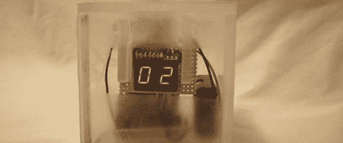

# 无线未读邮件计数器告诉你有多忙

> 原文：<https://hackaday.com/2013/06/08/wireless-unread-email-counter-tells-you-how-busy-youre-not/>

你有多忙的标志之一——或者你的垃圾邮件过滤器设置得有多好——就是你的收件箱里有多少未读邮件。Instructables 上的[trumpkin]发布了一个很棒的教程，教你如何制作一个无线计数器来显示你的 Gmail 账户中未读邮件的数量。

[trumpkin]使用了一个小型廉价的 419 MHz 发射机和接收机组合来实现这个项目。在他的桌面上，他连接了一个 USB 转 UART 桥，连接到发射机上。对于接收方，ATMega328 读取来自接收器的数据，并在两个七段显示器上显示未读电子邮件的数量。

该无线设备使用两节 AA 电池，应该能够提供足够的电力来保持电子邮件监视器长时间运行。有足够的时间让你的收件箱塞满，让你被你应该做的工作淹没。