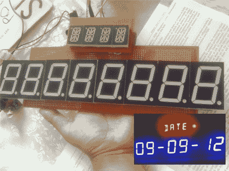

# 连接大量的 LED 显示屏

> 原文：<https://hackaday.com/2012/09/21/wiring-up-a-lot-of-led-segment-displays/>

一看这个显示器，你就知道有一大堆引脚需要连接。现在看看这些显示模块安装在什么上面。没错，[Kemley]正在使用点对点焊接来装配这个大显示屏。它的顶部有四个十六段模块用于显示字母数字信息，八个大的七段模块仅用于显示数字。

我们不确定电子设备是如何排列的。在谈到 16 段模块时，他提到所有四个模块都与 NPN 晶体管并联，以切换每个模块的公共阳极。这很容易理解。但是当你看到晶体管板时，你会看到有 24 个晶体管在使用。他在每个晶体管的集电极上加了一个 150 欧姆的电阻。它必须被设置为一次只允许每组中的一个网段打开。我们猜测每个部分被分成两部分(上部和下部引脚分别多路复用)，这可以解释双晶体管组。至于日期和时间，Arduino 板监控 DS1307 RTC 并管理显示器的扫描。