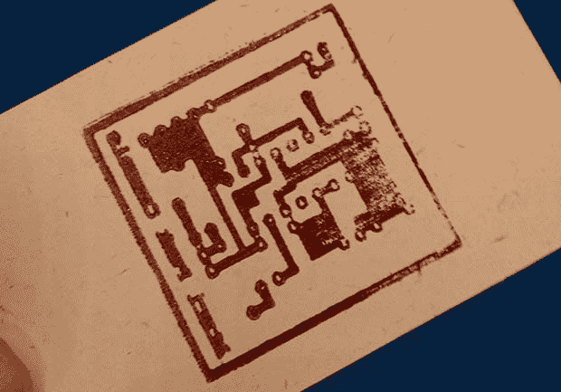

# 木刻邮票和导电墨水

> 原文：<https://hackaday.com/2013/10/18/woodcut-stamps-and-conductive-ink/>

尽管距离罗马创客节已经有一段时间了，但我们仍然从欧洲最大的创客聚会中获得了一些提示。其中一个是【Luong】的 [30 分钟实验。他想知道是否有可能通过使用 3D 打印机制作导电墨水的印章来制造 SMD 电路板。](http://luongbui.com/making-sense/)

[Luong]把这个想法告诉了集会周围的一些人，这个想法最终被来自 [TechLab](http://blog.techlab.tl/) 的家伙们所接受。意大利切丽黑客空间。他们建议用激光切割机切割一个木制邮票，在这个想法产生后的 30 分钟内，一个完整的雅达利朋克游戏机 PCB 邮票就在[Luong]手中。

作为一项实验，这个想法获得了巨大的成功。作为一个工具，邮票的表现并不如人意；痕迹没有正确转移，这个木制激光切割印章不可能制造出可用的印刷电路板。

也就是说，我们认为[Luong]在印刷电路板方面走在了正确的道路上。家庭制造的圣杯之一是制造印刷电路板，即使是部分的成功也是不容忽视的。

这种 CNC 制作 PCB 印章的想法可能适用于不同的材料——油毡或其他橡胶印章材料，甚至是 CNC 铣削铝板。如果你有任何关于如何使用这种技术制作 PCB 的想法，请在评论中留言，或者更好的是，亲自尝试一下。